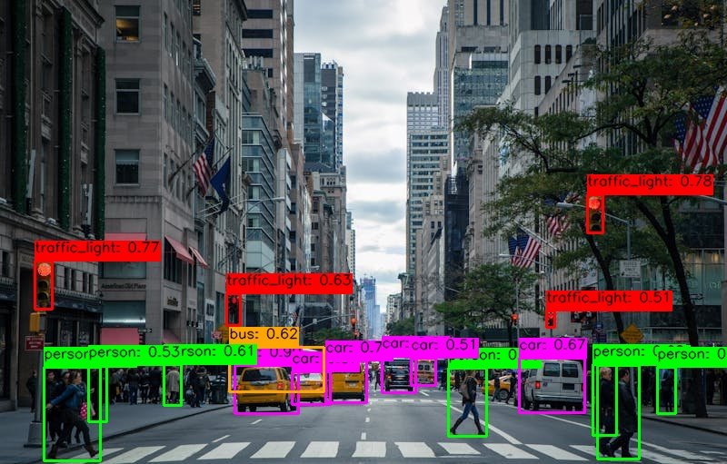

# 🚗 MareArts Road Objects Detection

[](https://badge.fury.io/py/marearts-road-objects)
[](https://www.python.org/downloads/)
[](LICENSE)
[](https://www.microsoft.com/windows)
[](https://www.linux.org/)
[](https://www.apple.com/macos/)

High-performance road object detection with 8-class support: **person**, **bicycle**, **motorcycle**, **car**, **bus**, **truck**, **traffic_light**, **stop_sign**. Built with advanced deep learning for accurate real-time detection.

🌐 **[Live Demo](https://live.marearts.com/?menu=road_objects)** | 🏠 **[Product Homepage](https://www.marearts.com/pages/marearts-road-objects-detector)**



## ✨ Features

- 🎯 **8-Class Detection**: 👤 person, 🚲 bicycle, 🏍️ motorcycle, 🚗 car, 🚌 bus, 🚚 truck, 🚦 traffic_light, 🛑 stop_sign
- ⚡ **GPU Acceleration**: NVIDIA CUDA and DirectML support
- 🛠️ **CLI Interface**: Easy command-line tools (`ma-robj`, `marearts-robj`)
- 🌐 **Cross-platform**: Windows (x64/ARM64), macOS (Intel/Apple Silicon), Linux (x64/ARM64)
- 🔑 **Unified License**: Same license works for both [MareArts-ANPR](https://github.com/MareArts/MareArts-ANPR) and Road Objects
- 🚀 **Auto-download**: Models download automatically on first use

## 🚀 Quick Start

### Installation

```bash
# Basic installation (CPU)
pip install marearts-road-objects

# With GPU acceleration (recommended)
pip install marearts-road-objects[gpu]          # NVIDIA CUDA
pip install marearts-road-objects[directml]     # Windows DirectML
pip install marearts-road-objects[all-gpu]      # All GPU support
```

### Get Your License

> 🔑 **Subscribe**: [MareArts ANPR/LPR Solution](https://www.marearts.com/products/anpr)
> 💡 **Important**: One license works for **both** ANPR and Road Objects packages!

## 🐍 Python API

### Simple Detection

```python
import cv2
from marearts_road_objects import ma_road_object_detector

# License credentials - Option A: Hardcoded
username = "your-email@domain.com"
serial_key = "your-serial-key"
signature = "your-signature"

# License credentials - Option B: From environment variables
# Step 1: ma-robj config              (Configure credentials)
# Step 2: source ~/.marearts/.marearts_env  (Load environment variables)
# import os
# username = os.getenv("MAREARTS_ANPR_USERNAME")
# serial_key = os.getenv("MAREARTS_ANPR_SERIAL_KEY")
# signature = os.getenv("MAREARTS_ANPR_SIGNATURE")

# Initialize detector ONCE (model downloads automatically on first use)
detector = ma_road_object_detector(
    model_name="small_fp32",  # Options: small_fp32, medium_fp32, large_fp32
    user_name=username,
    serial_key=serial_key,
    signature=signature,
    backend="auto",      # Options: "auto", "cuda", "directml", "cpu"
    conf_thres=0.5,      # Confidence threshold (0.0-1.0)
    iou_thres=0.5        # NMS IoU threshold (0.0-1.0)
)
# backend="auto" (recommended) - Auto-selects best available (CUDA → DirectML → CPU)

# Use detector.detector() for inference (can be called repeatedly in loops)
image = cv2.imread("traffic.jpg")
result = detector.detector(image)

# Result format (JSON)
print(result)
"""
{
    'results': [
        {'ltrb': [88.1, 421.0, 164.9, 476.2], 'ltrb_conf': 85, 'class_id': 3, 'class': 'car'},
    ],
    'ltrb_proc_sec': 0.078
}
"""
```

## 📊 Model Comparison

Choose the right model for your needs:

| Model Name | Model Size | Detection Speed | Accuracy |
|------------|------------|-----------------|----------|
| `small_fp32` | 102 MB | **8ms** (125 FPS) | Standard |
| `medium_fp32` | 195 MB | 83ms (12 FPS) | Better |
| `large_fp32` | 314 MB | 96ms (10 FPS) | Best |

**Benchmark System:**
- GPU: NVIDIA GeForce RTX (CUDA)
- CPU: Modern x86_64 processor
- Backend: CUDA (GPU accelerated)

## 🛠️ CLI Usage

### Configure License

```bash
# Interactive setup (recommended)
ma-robj config

# Or set environment variables
export MAREARTS_ANPR_USERNAME="your-email@domain.com"
export MAREARTS_ANPR_SERIAL_KEY="your-serial-key"
export MAREARTS_ANPR_SIGNATURE="your-signature"
```

After configuration, source the environment:
```bash
source ~/.marearts/.marearts_env
```

### Available Commands

```bash
ma-robj config               # Configure license credentials
ma-robj validate             # Validate license
ma-robj detect IMAGE         # Detect objects in image
ma-robj gpu-info             # Check GPU acceleration support
ma-robj version              # Show package version
ma-robj detect traffic.jpg   # Detection Example
```

**Command Aliases:** `ma-robj`, `marearts-robj`, `marearts-road-objects` (all work the same)

## 📊 Output Format

ANPR-compatible JSON format for easy integration:

```python
{
    'results': [
        {
            'ltrb': [88.1, 421.0, 164.9, 476.2],  # Bounding box [left, top, right, bottom]
            'ltrb_conf': 85,                       # Confidence 0-100 (integer)
            'class_id': 3,                         # Class ID (0-7)
            'class': 'car'                         # Class name
        },
        {
            'ltrb': [201.3, 401.7, 265.1, 452.2],
            'ltrb_conf': 84,
            'class_id': 3,
            'class': 'car'
        }
    ],
    'ltrb_proc_sec': 0.178  # Processing time in seconds
}
```

## 🎯 Detection Classes

| ID | Class | Description |
|----|-------|-------------|
| 0 | person | Pedestrians and people |
| 1 | bicycle | Bicycles |
| 2 | motorcycle | Motorcycles and scooters |
| 3 | car | Passenger cars |
| 4 | bus | Buses |
| 5 | truck | Trucks and vans |
| 6 | traffic_light | Traffic signals |
| 7 | stop_sign | Stop signs |

## 🔧 Environment Variables

```bash
# Skip model update checks for faster initialization (production)
export MAREARTS_ROBJ_SKIP_UPDATE=1

# Enable verbose logging for debugging
export MAREARTS_VERBOSE=1
```

## 📝 Example Code

Check the `examples/` folder for complete working examples:
- **basic_detection.py** - Simple detection example
- **batch_processing.py** - Process multiple images
- **cli_examples.sh** - CLI command reference

## 🎯 Try Road Object Detector

**Web Demo:** [https://live.marearts.com/?menu=road_objects](https://live.marearts.com/?menu=road_objects)

**API Test** (1000 free requests/day) - Just change the model name and image path:

```bash
curl -X POST "https://we303v9ck8.execute-api.eu-west-1.amazonaws.com/Prod/marearts_robj" \
  -H "Content-Type: image/jpeg" \
  -H "x-api-key: !23J4K9L2Wory34@G7T1Y8rt-PP83uSSvkV3Z6ioSTR!2" \
  -H "user-id: marearts_robj@public" \
  -H "model_name: small_fp32" \
  --data-binary "@your_image.jpg"
```

Only change: `model_name` (small_fp32/medium_fp32/large_fp32) and `@your_image.jpg`

**Need unlimited access?** [Get Your License](https://www.marearts.com/products/anpr)

## 🆘 Support

- **License**: [Get your subscription](https://www.marearts.com/products/anpr)
- **Issues**: [GitHub Issues](https://github.com/MareArts/MareArts-Road-Objects/issues)
- **Email**: hello@marearts.com

## 🔗 Related Packages

**MareArts AI Ecosystem** (same license for all):
- **[marearts-anpr](https://github.com/MareArts/MareArts-ANPR)** - License plate recognition (ANPR/ALPR)
- **[marearts-crystal](https://github.com/MareArts/marearts-crystal)** - Licensing framework
- **[marearts-xcolor](https://github.com/MareArts/marearts-xcolor)** - Color space conversions

---

**© 2024 MareArts. All rights reserved.**